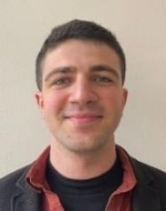

{fig-align="center" width="170px"}

# Education

• 2015-2019 Ankara Ataturk Anatolian High School \| Science/Mathematics student

• 2019-2021 B.S., Electrical and Electronics Engineering, Bilkent (Comprehensive Scholarship: %100 + Stipend)

• 2021-2025 B.S., Industrial Engineering, Bilkent (Comprehensive Scholarship: %100 + Stipend)

• 2025-2027 M.S., Industrial Engineering, Hacettepe

# Work Experience

• Jun-Sep '22 British American Tobacco \| Spare Parts Department, Production Intern

• 2023-2025 SIEMENS Grid Software \| Assistant Sales Specialist, Remote

• 2025- ROKETSAN \| Supply Chain Engineer

# Extracurricular Activities

• Ankara Ataturk Anatolian High School Orchestra (Sep 2016 - Jun 2017) - Orchestra drummer

• Bilkent IEEE Club (Jan 2020-June 2021) - Team Member and Presenter at the Kariyer Forum’21

• Bilkent Music Club (Jan 2020-July 2022) - Board Member responsible for campus events

• Boogie People Band (July 2021 - July 2024) - Drummer at performance halls

• Baskent Communication Academy (Jan-May 2025) - Voice Over & Dubbing

[Download CV](assets/cv/emre_cv.pdf){.btn-custom target="_blank"}
